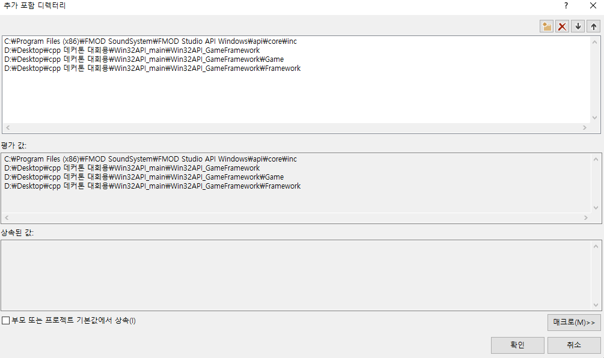
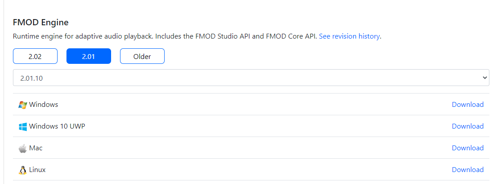

Devsign 데커톤 
==============


# 사전 작업
    * fmod를 반드시 설치해야 해당 코드가 빌드가 됩니다.

    * 제가 먼저 상대경로로 작업을 끝내놓았으나, 만약에 빌드가 안된다면 아래 경로로 바꿔주시길 바랍니다.
    빌드가 된다면 굳이 경로 작업을 할 필요 없습니다.

>fmod 설치 [FMOD Studio Suite]
    * C:\Program Files (x86)\FMOD SoundSystem\FMOD Studio API Windows\api\studio\lib\x86\fmodstudio.dll,
    C:\Program Files (x86)\FMOD SoundSystem\FMOD Studio API Windows\api\core\lib\x86\fmod.dll
     파일을 프로젝트파일 폴더에
    Win32API_main\x62\Debug 폴더에 추가

    * 해당 파일들을 Debug 폴더에 추가해도 fmod.dll 파일을 찾을 수 없다고 할 시, x86이 아닌 x64에서 똑같은 파일을 찾아서 추가해주세요.

>프로젝트 속성->C/C++
추가 포함 디렉터리에 다음 경로 추가
    * C:\Program Files (x86)\FMOD SoundSystem\FMOD Studio API Windows\api\studio\inc

    * 본인 프로젝트의 Win32API_GameFramework\Game 폴더

    * 본인 프로젝트의 Win32API_GameFramework\Framework 폴더
    
    * 본인 프로젝트의 Win32API_GameFramework 폴더

>프로젝트 속성->링커->일반->추가 라이브러리 디렉터리

    *C:\Program Files (x86)\FMOD SoundSystem\FMOD Studio API Windows\api\core\lib\x64

- 해당 작업들을 해주어야 정상적으로 빌드 및 실행을 할 수 있습니다.



- fmod는 해당 페이지에서 설치할 수 있습니다. https://www.fmod.com/download



----------------------------------

#규칙

	모든 클래스, 구조체, 열거 형식, 인터페이스 이름 앞에는 접두어를 사용할 것

	    - 클래스 : C        
	    - 구조체 : F
	    - 인터페이스 : I
	    - 열거 형식 : E
	    - 이러한 접두어는 파일명에는 사용하지 않습니다.

----------------------------------

>1. 모든 오브젝트에는 공통적으로 상속받는 클래스가 하나 있습니다. 어떤 클래스인가요?


>2. 일부 오브젝트에는 위치 정보를 담기 위해서 상속받는 클래스가 하나 있습니다. 어떤 클래스인가요? 그리고 어떤 해당 정보를 담는 필드는 무엇인가요?

>3. 해당 프로젝트 파일에는 디버그 로그를 찍는 함수 매크로가 존재합니다. 해당 매크로를 사용해서 실시간으로 현재 캐릭터의 위치를 확인하고자 할 때, 어떤 파일에 어떤 코드를 어디에 추가해야 할까요? 

>4. 함수의 뒤에는 다음과 같이 `const` 라는 키워드를 쓸 수 있습니다. 해당 키워드는 왜 쓰는 것이며, 어떤 효과를 얻을 수 있을까요?
```
FORCEINLINE class CPlayerCharacterMovementHelperComponent* GetMovementHelper() const
```

>5. 다음은 `CPlayerHUD`의 선언부 입니다. 필드 중에서 클래스의 선언이 아님에도 불구하고 `class` 키워드를 사용하는 부분이 있는데요, 왜 해당 키워드를 사용하는지, 그리고 어떨 때 사용하고, 사용하면 어떤 효과를 얻을 수 있을까요?
```
PlayerHUD.h


CLASS(CPlayerHUD, CUIObject)
class CPlayerHUD :
    public CUIObject
{
    USE_CLASS(CPlayerHUD);

private :
    class CUISpriteRendererComponent* HpBackground;
    class CUISpriteRendererComponent* HpForeground;
    class CUISpriteRendererComponent* HpIcon;

public :
    virtual void Initialize() override;

public :
    void SetHp(float hp);

};
```

>6. 해당 게임 맵에서는 물체, 즉 객체를 맵에 추가하기 위해서는 어떤 클래스에서 어떤 함수를 호출해야 합니다. 무엇일까요?


>7. 다음은 `PlayerCharacter.cpp`의 코드 중 일부분입니다. 해당 부분에서는 객체를 생성하지 않았지만 해당 객체의 함수를 쓰고 있습니다. 어떻게 해야 그렇게 할 수 있을까요? 그리고 해당 기술을 써서 어떤 이점을 얻을 수 있을까요?
```
InputAxis = FVector(
	CInput::GetAxis(TEXT("Horizontal")),
	CInput::GetAxis(TEXT("Vertical")));
```

>8. `GameObject` 에는 override 할 수 있는 여러 함수가 있습니다. `Initialize()`, `Start()`, `Tick()`, `OnDestroy()`, `Release()`가 있습니다. 해당 함수들의 호출 시기는 언제이며, 무슨 역할을 하나요? 오브젝트의 Lifecycle을 묻는 문제입니다.

>9. 해당 프로젝트에는 충돌을 검사하는 함수가 있습니다. 충돌의 종류에는 크게 3가지가 있습니다. `원과 원`, `사각형과 사각형`, `사각형과 원`끼리의 충돌입니다. 그중에서 `원과 원`의 충돌이 구현된 소스코드는 무엇이며, 어떤 원리로 구현되나요?

>10. 해당 프로젝트에는 template으로 작성된 `Cast 함수` 하나와 `IsA 함수`가 두 개 있습니다. 각각 어떤 역할을 하고 어떤 원리로 구현했을까요?
```
Object.h


	template<typename ParentType, typename ChildType>
	FORCEINLINE static bool IsA(ChildType* childInstance)
	{ return (dynamic_cast<ParentType*>(childInstance) != nullptr); }

	template<typename ParentType, typename ChildType>
	FORCEINLINE static bool IsA()
	{ return is_base_of<ParentType, ChildType>(); }

	template<typename TargetType, typename T>
	FORCEINLINE static TargetType* Cast(T* instance)
	{ return dynamic_cast<TargetType*>(instance); }
```

>11. `GameDebug.h` 에는 해당 소스코드가 있습니다. 어떤 의미일까요?
```
#ifdef UNICODE
#define CONSOLE_LINKER "/entry:wWinMainCRTStartup /subsystem:console"
#else
#define CONSOLE_LINKER "/entry:WinMainCRTStartup /subsystem:console"
#endif

#if GAME_DEBUG_MODE == true
#pragma comment (linker, CONSOLE_LINKER)
#endif

#ifdef UNICODE
#define tcout wcout
#else 
#define tcout cout
#endif

```


>12. 다음은 `SpriteRendererComponent class`의 선언부입니다. 클래스 앞에 `CLASS()` 매크로와 `USE_CLASS()`매크로는 어떤 역할을 하며, 어떤 효과를 볼 수 있을까요?
```
CLASS(CSpriteRendererComponent, CRenderComponent)
class CSpriteRendererComponent :
    public CRenderComponent
{
    USE_CLASS(CSpriteRendererComponent);
```

>13. `FVector`는 어떤 변수들을 담고있나요?

>14. 최적화를 위한 기법인 `Object Pool` 이라는 것 template으로 구현되어있습니다. 해당 부분은 어떻게, 어떤 원리로 구현되어있나요?

>15. `선형보간`이라는 개념이 있습니다. 해당 개념은 `Math.h`에 구현되어있는데요, 어떤 개념이고, 어떤 원리로 구현되어있나요?

>16. `FRect::GetSize()`는 무엇을 반환하는 함수인가요?

>17. `UISpriteRendererComponent` 에서 `GetBounds()` 함수는 무엇을 반환하나요? 그리고 해당 함수는 어디로부터 override 되었나요?

>18. `MovementComponent`에서 `Velocity`는 무엇을 의미하나요? 

>19. 다음은 `PlayerMovementComponentHelper` 클래스의 함수입니다. 해당 함수는 어떤 역할을 하고, 어떤 원리로 동작하는지 간단하게 설명하세요.
```
void CPlayerCharacterMovementHelperComponent::CheckBlockingTile()
{
	if (TileMap == nullptr) return;
	if (TileMapIndexX == INDEX_NONE || TileMapIndexY == INDEX_NONE) return;

	FRect currentTileBoundaray = FRect(
		TileMap->GetTileLT(TileMapIndexX, TileMapIndexY),
		TileMap->GetTileRB(TileMapIndexX, TileMapIndexY));

	FRect mapBoundary = FRect(
		TileMap->Position,
		TileMap->Position + TileMap->GetMapSize());

	Movement->GetMovableAreaLT().X = (TileMap->IsBlockingTile(TileMapIndexX - 1, TileMapIndexY)) ?
		currentTileBoundaray.Min.X : mapBoundary.Min.X;
	Movement->GetMovableAreaRB().X = (TileMap->IsBlockingTile(TileMapIndexX + 1, TileMapIndexY)) ?
		currentTileBoundaray.Max.X : mapBoundary.Max.X;
	
	Movement->GetMovableAreaLT().Y = (TileMap->IsBlockingTile(TileMapIndexX, TileMapIndexY - 1)) ?
		currentTileBoundaray.Min.Y : mapBoundary.Min.Y;
	Movement->GetMovableAreaRB().Y = (TileMap->IsBlockingTile(TileMapIndexX, TileMapIndexY + 1)) ?
		currentTileBoundaray.Max.Y : mapBoundary.Max.Y;


	if (TileMap->IsBlockingTile(TileMapIndexX, TileMapIndexY))
	{
		int32 tileAxisX = (PlayerCharacter->Position.X < currentTileBoundaray.GetCenter().X) ? -1 : 1;
		int32 tileAxisY = (PlayerCharacter->Position.Y < currentTileBoundaray.GetCenter().Y) ? -1 : 1;

		FVector nearestBoudary = currentTileBoundaray.GetBoundaryFromIntAxis(tileAxisX, tileAxisY);

		FVector boundaryDistance = FVector(
			FMath::Distance(nearestBoudary.X, PlayerCharacter->Position.X),
			FMath::Distance(nearestBoudary.Y, PlayerCharacter->Position.Y));

		if (boundaryDistance.X < boundaryDistance.Y)
			PlayerCharacter->Position.X = nearestBoudary.X;
		else PlayerCharacter->Position.Y = nearestBoudary.Y;
	}
}
```